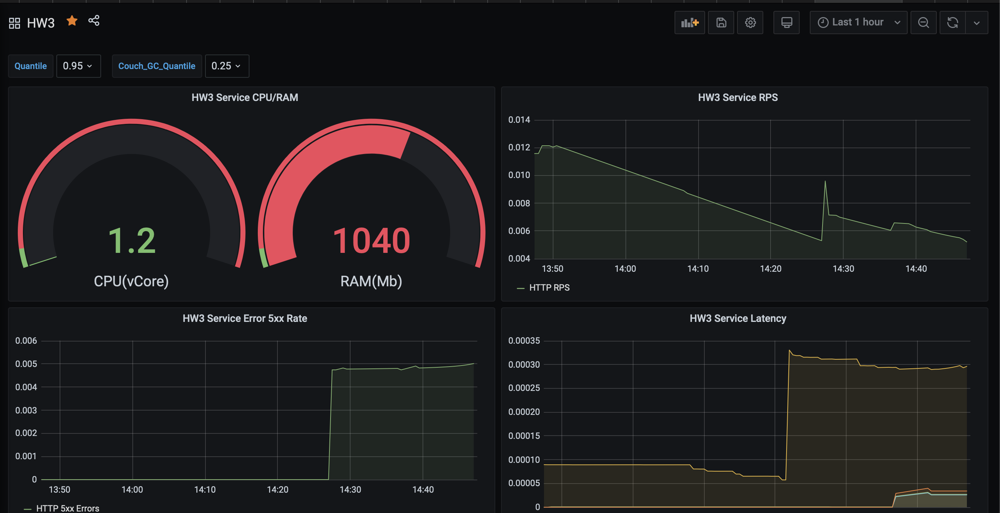
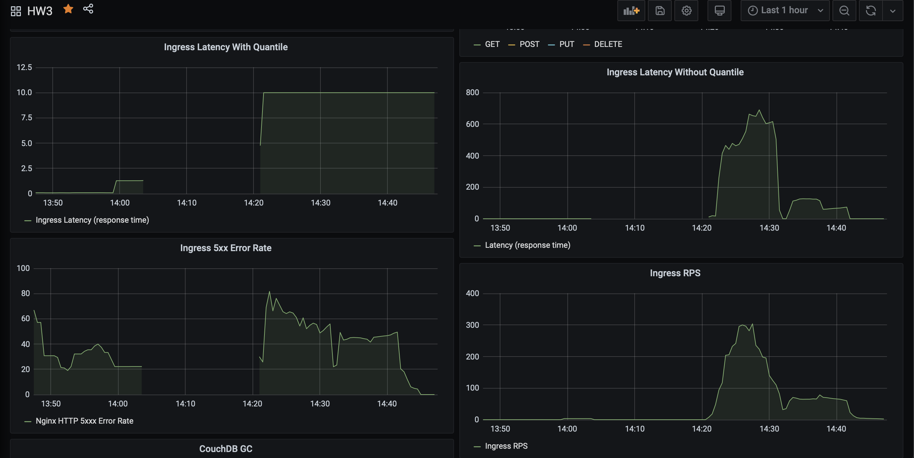
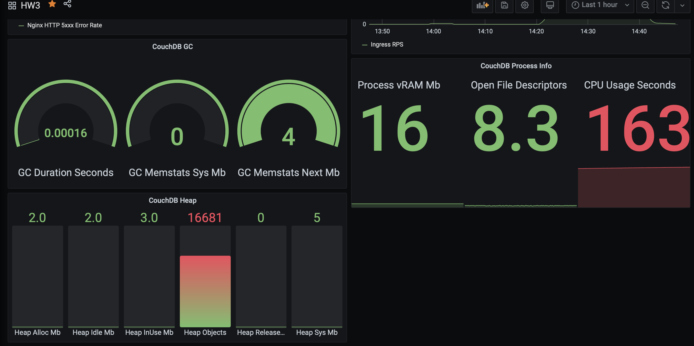
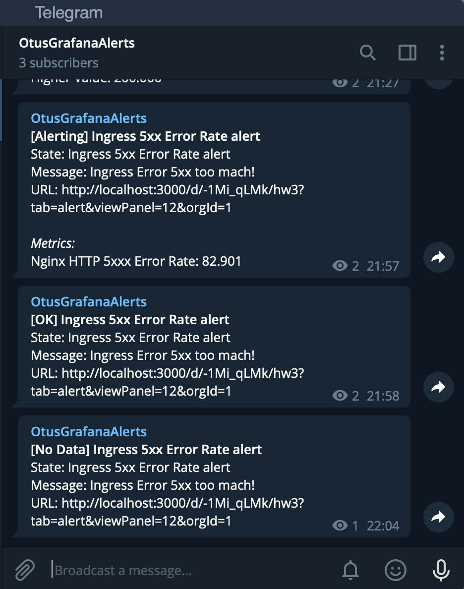
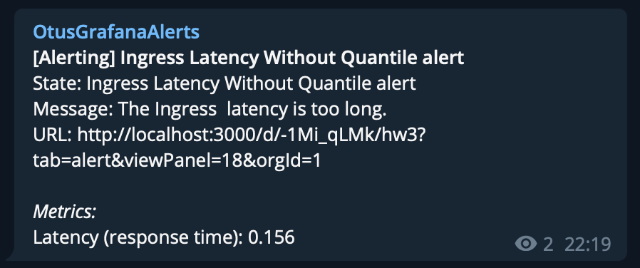

# Homework project for the course OTUS: [Software Architect](https://otus.ru/lessons/arhitektor-po/) 2020

## Тема: Prometheus. Grafana ##

### Домашнее задание ###

Prometheus. Grafana

Инструментировать сервис из прошлого задания метриками в формате Prometheus с помощью библиотеки для вашего фреймворка и ЯП. 

Сделать дашборд в Графане, в котором были бы метрики с разбивкой по API методам:

1. Latency (response time) с квантилями по 0.5, 0.95, 0.99, max 
2. RPS
3. Error Rate - количество 500ых ответов

Добавить в дашборд графики с метрикам в целом по сервису, взятые с nginx-ingress-controller:

1. Latency (response time) с квантилями по 0.5, 0.95, 0.99, max 
2. RPS
3. Error Rate - количество 500ых ответов

Настроить алертинг в графане на Error Rate и Latency.

На выходе должно быть:

0. скриншоты дашборды с графиками в момент стресс-тестирования сервиса. Например, после 5-10 минут нагрузки.
1.  json-дашборды.


Задание со звездочкой (+5 баллов)
Используя существующие системные метрики из кубернетеса, добавить на дашборд графики с метриками:

1. Потребление подами приложения памяти
2. Потребление подами приолжения CPU

Инструментировать базу данных с помощью экспортера для prometheus для этой БД. 
Добавить в общий дашборд графики с метриками работы БД.


### Примечания к решению: ###

- Был использован стек [Ballerina.io](https://ballerina.io/) имеющий интеграцию с [Docker](https://ballerina.io/learn/deployment/docker/).
  Описание конфигурации Docker начинается в коде приложения `./hw3-service-with-k8s-monitoring/src/simplerest/view.ba` в соответствии с [документацией](https://github.com/ballerina-platform/module-ballerina-docker).
  Для работы с K8S Secrets и использования их как ENV в контейнере сделана подмена строки `CMD` в Dockerfile через конфигурацию в коде `./hw3-service-with-k8s-monitoring/src/simplerest/view.bal` .

- В качестве базы данных использован стек [Apache CouchDB](https://couchdb.apache.org) из [официального Helm3](https://artifacthub.io/packages/helm/couchdb/couchdb).

- Helm 3 находятся в директории `./hw3-service-with-k8s-monitoring/helm/service-monitoring/`.

- Ссылка на [публичную коллекцию Postman](https://www.getpostman.com/collections/a57a15611e86c9adf190).

- Для снятия метрик с базы данных CouchDB использован экспортер [prometheus-couchdb-exporter](https://artifacthub.io/packages/helm/prometheus-community/prometheus-couchdb-exporter), но он не создает `PodMonitor` или `ServiceMonitor` самостоятельно, поэтому в файле `./hw3-service-with-k8s-monitoring/helm/service-monitoring/templates/servicemonitor.yaml` присутствует ServiceMonitor как для разработанного в рамках задания сервиса, так и для сервса наблюдения за базой данной CouchDB.

- В данном примере использовался готовый стек Grafana + Prometheus: [kube-prometheus-stack](https://artifacthub.io/packages/helm/prometheus-community/kube-prometheus-stack).

- Для установки Nginx Ingress Controller вместе с необходимыми компонентами мониторинга следует выполнит следующую команду:

```
helm install ingress-controller ingress-nginx/ingress-nginx --namespace ingress-nginx --set controller.metrics.enabled=true --set controller.metrics.serviceMonitor.enabled=true --set-string controller.metrics.serviceMonitor.additionalLabels."release=prometheus-stack"
```

- В данном задании активно использовались Helm Template Functions поэтому имена компонентов, ссылки на них и доступы к базе данных создаются динамически. Заметка для себя: функции в templates мутируют в завивимости от уровня вложенности в зависимых helm.

- Для импорта схемы базы данных данных и создания в ней пользователя для мониторинга состояния БД используется K8S Job.
- Для наблюдения за сервисом при помощи Prometheus используется подключаемый через `ConfigMap` параметр активации метрик в Ballerina из [официальной документации](https://ballerina.io/learn/observing-ballerina-code/).
- Для создания нагрузки был использовал собственный проект нагрузочного теста на основе Gatling оформленный как JAR-приложение https://github.com/kkeker/Gatling-JAR-App

**Build для Ballerina v1.2.13+ & Balerina Tools 0.8.14+:**

- `export DOCKER_USER={LOGIN_DOCKERHUB} && export DOCKER_PASS={PASSWORD_DOCKERHUB} && bal build -a`

**Deploy с использованием Helm 3**

- `helm install --dependency-update hw3 ./hw3-service-with-k8s-monitoring/helm/service-monitoring/`

Имя инсталляции может быть любым, в Helm исполуются template-функции для генерации зависимых url и имен.

#### JSON-схема Dashboard из Grafana:

Экспортированная JSON-схема доски из Grafana находится в каталоге `docs/grafana-dashboard.json`

#### Примеры снимков экрана Grafana Dashboard:







#### Тестирование Grafana Alerting:

Уведомления настроены для Ingress Error 5xx Rate и Ingress Latency.

Для тестирования 5xx Error Rate необходимо запустить в консоли:

```
for i in {1..1000}; do curl -X POST http://arch.homework/otusapp/kkeker/api/v1/user -H 'Host: arch.homework' -H 'Content-Type: application/json' -d '{}' && sleep 5; done
```

Для тестирования Latency необходимо запустить [нагрузочный тест Gatling](https://github.com/kkeker/Gatling-JAR-App):

- `docker build -t otushw3 .`





#### Справочники про PromQL, использованные в задании:

- https://docs.gitlab.com/ee/user/project/integrations/prometheus_library/nginx_ingress_vts.html
- https://lab.las3.de/gitlab/help/user/project/integrations/prometheus_library/nginx_ingress.md
- https://microfluidics.utoronto.ca/gitlab/help/user/project/integrations/prometheus_library/nginx.md
- https://prometheus.io/docs/practices/histograms/
- https://prometheus.io/docs/prometheus/latest/querying/functions/
- https://www.robustperception.io/how-does-a-prometheus-histogram-work
- https://docs.gitlab.com/ee/user/project/integrations/prometheus_library/nginx_ingress.html
- https://github.com/infinityworks/prometheus-example-queries
- https://github.com/jeremyrickard/rps-demo-prometheus