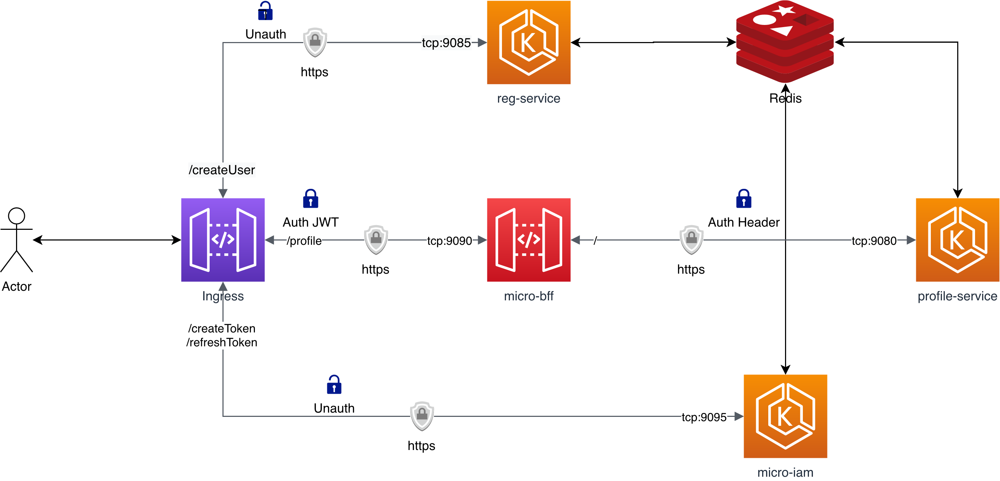
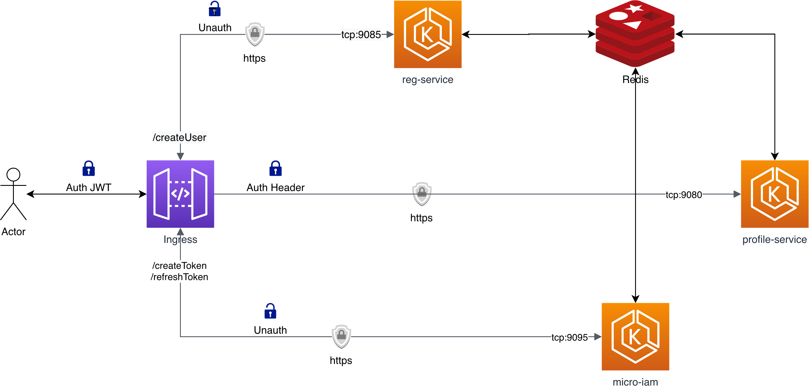
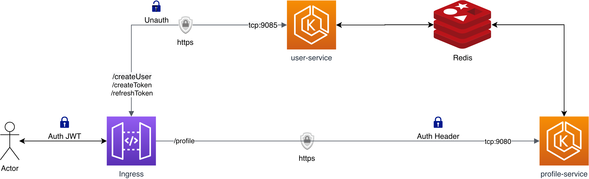
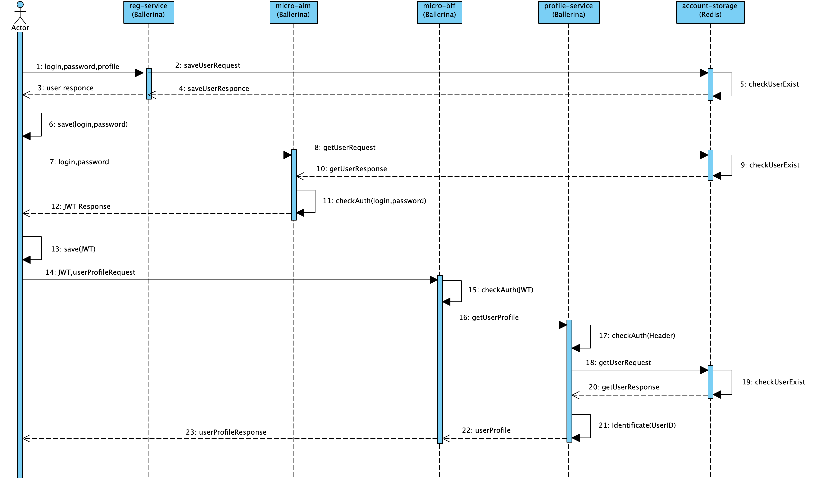
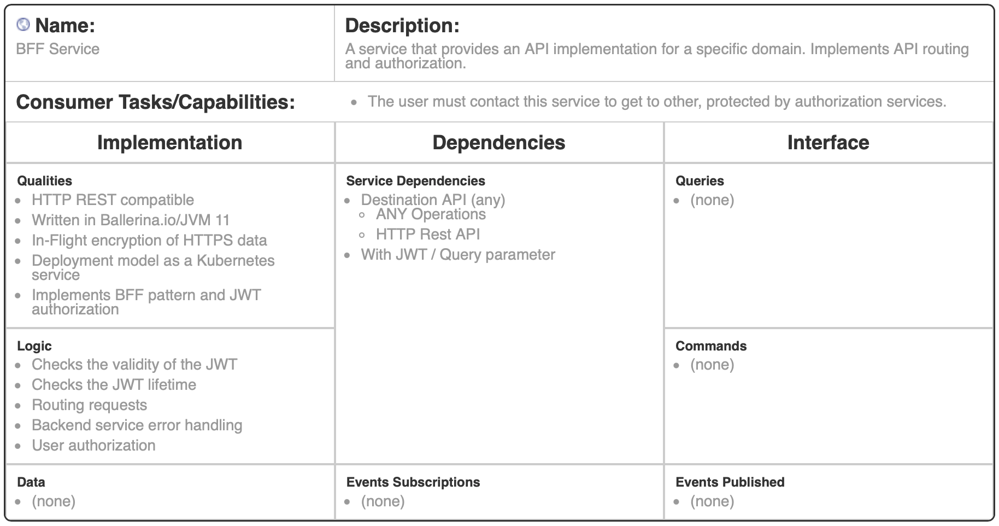
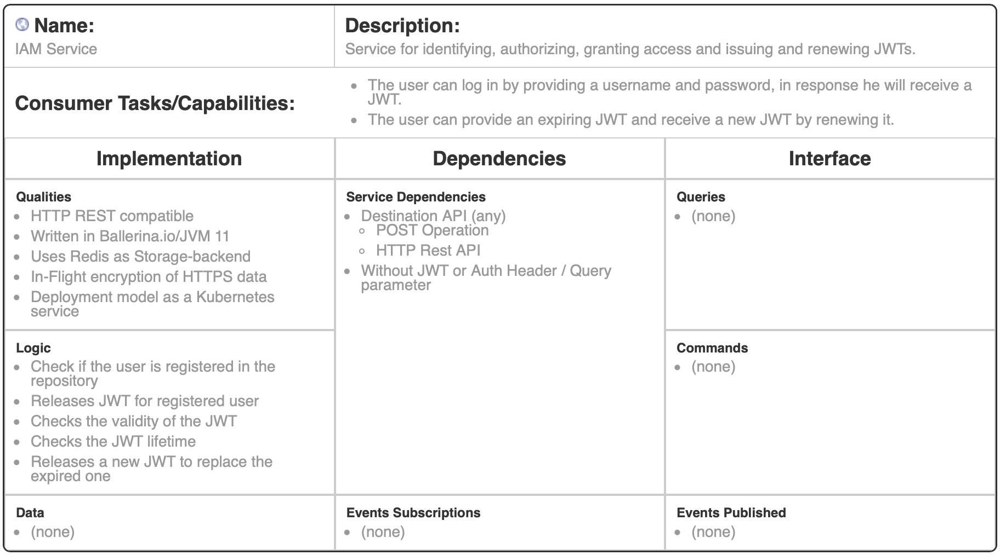
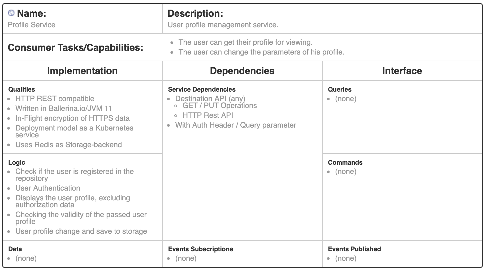
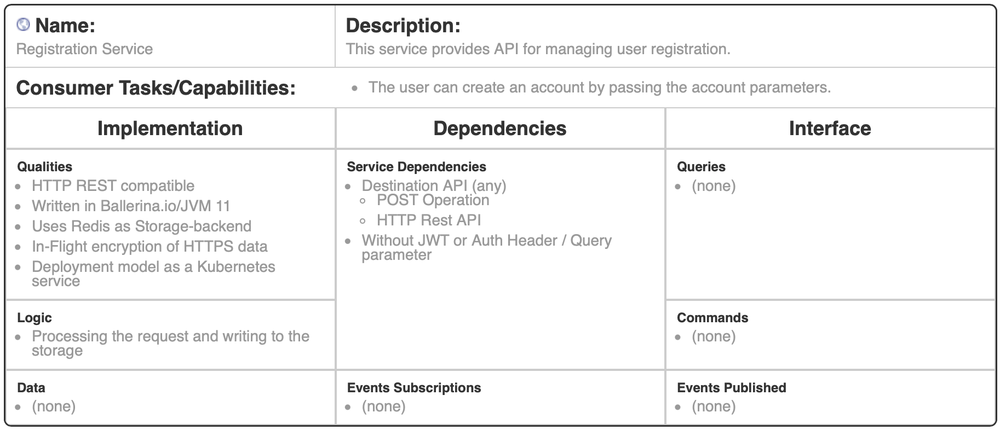

# Homework project for the course OTUS: [Software Architect](https://otus.ru/lessons/arhitektor-po/) 2020

## Тема: Паттерны декомпозиции микросервисов.

### Домашнее задание

Паттерны декомпозиции микросервисов

Разделите ваше приложение на несколько микросервисов с учетом будущих изменений.

Попробуйте сделать несколько вариантов разбиений и попробуйте их оценить. Выберите вариант, который вы будете реализовывать.

На выходе вы должны предоставить 

1. Пользовательские сценарии
2. Общую схему взаимодействия сервисов.
3. Для каждого сервиса опишите назначение сервиса и его зону ответственности.
4. Опишите контракты взаимодействия сервисов друг с другом.

## Примечания к решению:

### 3 варианта декомпозиции микросервисов с разным разделением зон отвественности:

В этом варианте применено максимальное разделение ролей для дальнейшего масштабирования:

- reg-service - осуществляет только регистрацию пользователей, он может быть федеративным регистратором с разных источников, таких как социальные сети или собественной системы создания учетных записей. Дальнейшем, сервис может заниматься сопоставлением учетных записей из разных федеративных источников.
- micro-iam - только сервис выпуска JWT ключей, реализует цикл жизни выбранной модели авторизации, может реализовывать несколько вариантов авторизации на базе JWT, а том чистел OAuth2 или OIDC. Может использовать OTP и MFA для дополнительной проверки.
- profile-service - сервис, с бизнес-логикой управления профилем пользователя (просмотр, редактирование, удаление и т.д.), представляет из себя один из сервисов, которые находится в защищенной инвраструктуре за BFF, не принимает участие в авторизации и получает только идентификатор пользователя в HTTP Heared для реализации собственного RBAC/ABAC внутри сервиса. HTTP Header за него извлекает из JWT Body сервис BFF.
- micro-bff - сервис реализации патеррнта BFF. Позволяет предоставить имплементацию необходимой API потребителям, защитив внутренний сервисы JWT-авторизацией в парадигме микросервисов. Так же, извлекает из JWT поле sub и превращает его в HTTP Hearder для передачи в сервисы за ним для целей аутентификации. Осуществляет роутинг и перезапись путей API для составления единой карты URL.

В данном варинте нет паттенра BFF, подразуменвается что нет необходимости предоставлять разные имплементации API разным потребителем. Могут быть только задачи перезаписи маршрутов и авторизации. Тогда с этой задачей справится API Gateway или Ingress в системе развертывания Kubernetes (как в примере).

Остальные роли сервисов остаются без изменения как варинте 1.

В данном варианте, как и в варианте 2, нет паттерна BFF, его роль по прежнему выполняет сервис API Gateway или Ingress в Kubernetes.

Так же, в этом варианте упрощена схема и смешаны домены авторизации/аутентификации и выпуска ключей. Для этого есть сервис user-service. Данный вариант подходит для начала развития приложения и больше похож на этап развития монолитного приложения.

### Диаграмма последовательности запросов для варианта 1:

### OpenAPI v3 IDLs варианта 1:

- [micro-iam](idl/micro-iam.yml)
- [profile-service](idl/profile-servoce.yml)
- [reg-service](idl/reg-service.yml)

Инструмент просмотра IDL формата OpenAPI и Swagger https://editor.swagger.io

### Microservices Canvas варианта 1:

[micro-bff-canvas схема в формате json для сервиса solusoftsl](canvas/micro-bff.json)

[Режим просмотра](https://solusoftsl.github.io/microservices-design-canvas-editor/html/iframe.html?base64json=eyJtZGNmIjoiMS4wLjAiLCJpZCI6Im1pY3JvLWJmZiIsInVybCI6Imh0dHBzOi8vZ2l0aHViLmNvbS9ra2VrZXIvT1RVUy1Tb2Z0d2FyZUFyY2hpdGVjdDIwMjAvdHJlZS9odzVfQkZGX0FQSS1HYXRld2F5L2h3NS1qd3QtYXJjaC9taWNyby1iZmYiLCJuYW1lIjoiQkZGIFNlcnZpY2UiLCJkZXNjcmlwdGlvbiI6IkEgc2VydmljZSB0aGF0IHByb3ZpZGVzIGFuIEFQSSBpbXBsZW1lbnRhdGlvbiBmb3IgYSBzcGVjaWZpYyBkb21haW4uIEltcGxlbWVudHMgQVBJIHJvdXRpbmcgYW5kIGF1dGhvcml6YXRpb24uIiwiY2FwYWJpbGl0aWVzIjpbIlRoZSB1c2VyIG11c3QgY29udGFjdCB0aGlzIHNlcnZpY2UgdG8gZ2V0IHRvIG90aGVyLCBwcm90ZWN0ZWQgYnkgYXV0aG9yaXphdGlvbiBzZXJ2aWNlcy4iXSwiaW1wbGVtZW50YXRpb24iOnsicXVhbGl0aWVzIjpbIkhUVFAgUkVTVCBjb21wYXRpYmxlIiwiV3JpdHRlbiBpbiBCYWxsZXJpbmEuaW8vSlZNIDExIiwiSW4tRmxpZ2h0IGVuY3J5cHRpb24gb2YgSFRUUFMgZGF0YSIsIkRlcGxveW1lbnQgbW9kZWwgYXMgYSBLdWJlcm5ldGVzIHNlcnZpY2UiLCJJbXBsZW1lbnRzIEJGRiBwYXR0ZXJuIGFuZCBKV1QgYXV0aG9yaXphdGlvbiJdLCJsb2dpYyI6WyJDaGVja3MgdGhlIHZhbGlkaXR5IG9mIHRoZSBKV1QiLCJDaGVja3MgdGhlIEpXVCBsaWZldGltZSIsIlJvdXRpbmcgcmVxdWVzdHMiLCJCYWNrZW5kIHNlcnZpY2UgZXJyb3IgaGFuZGxpbmciLCJVc2VyIGF1dGhvcml6YXRpb24iXSwiZGF0YSI6W119LCJkZXBlbmRlbmNpZXMiOnsic2VydmljZURlcGVuZGVuY2llcyI6W3sidGl0bGUiOiJEZXN0aW5hdGlvbiBBUEkgKGFueSkiLCJsaXN0IjpbIkFOWSBPcGVyYXRpb25zIiwiSFRUUCBSZXN0IEFQSSJdfSwiV2l0aCBKV1QgLyBRdWVyeSBwYXJhbWV0ZXIiXSwiZXZlbnRzU3Vic2NyaXB0aW9ucyI6W119LCJpbnRlcmZhY2UiOnsicXVlcmllcyI6W10sImNvbW1hbmRzIjpbXSwiZXZlbnRzUHVibGlzaGVkIjpbXX19)

[micro-iam-canvas схема в формате json для сервиса solusoftsl](canvas/micro-iam.json)

[Режим просмотра](https://solusoftsl.github.io/microservices-design-canvas-editor/html/iframe.html?base64json=eyJtZGNmIjoiMS4wLjAiLCJpZCI6Im1pY3JvLWlhbSIsInVybCI6Imh0dHBzOi8vZ2l0aHViLmNvbS9ra2VrZXIvT1RVUy1Tb2Z0d2FyZUFyY2hpdGVjdDIwMjAvdHJlZS9odzVfQkZGX0FQSS1HYXRld2F5L2h3NS1qd3QtYXJjaC9taWNyby1pYW0iLCJuYW1lIjoiSUFNIFNlcnZpY2UiLCJkZXNjcmlwdGlvbiI6IlNlcnZpY2UgZm9yIGlkZW50aWZ5aW5nLCBhdXRob3JpemluZywgZ3JhbnRpbmcgYWNjZXNzIGFuZCBpc3N1aW5nIGFuZCByZW5ld2luZyBKV1RzLiIsImNhcGFiaWxpdGllcyI6WyJUaGUgdXNlciBjYW4gbG9nIGluIGJ5IHByb3ZpZGluZyBhIHVzZXJuYW1lIGFuZCBwYXNzd29yZCwgaW4gcmVzcG9uc2UgaGUgd2lsbCByZWNlaXZlIGEgSldULiIsIlRoZSB1c2VyIGNhbiBwcm92aWRlIGFuIGV4cGlyaW5nIEpXVCBhbmQgcmVjZWl2ZSBhIG5ldyBKV1QgYnkgcmVuZXdpbmcgaXQuIl0sImltcGxlbWVudGF0aW9uIjp7InF1YWxpdGllcyI6WyJIVFRQIFJFU1QgY29tcGF0aWJsZSIsIldyaXR0ZW4gaW4gQmFsbGVyaW5hLmlvL0pWTSAxMSIsIlVzZXMgUmVkaXMgYXMgU3RvcmFnZS1iYWNrZW5kIiwiSW4tRmxpZ2h0IGVuY3J5cHRpb24gb2YgSFRUUFMgZGF0YSIsIkRlcGxveW1lbnQgbW9kZWwgYXMgYSBLdWJlcm5ldGVzIHNlcnZpY2UiXSwibG9naWMiOlsiQ2hlY2sgaWYgdGhlIHVzZXIgaXMgcmVnaXN0ZXJlZCBpbiB0aGUgcmVwb3NpdG9yeSIsIlJlbGVhc2VzIEpXVCBmb3IgcmVnaXN0ZXJlZCB1c2VyIiwiQ2hlY2tzIHRoZSB2YWxpZGl0eSBvZiB0aGUgSldUIiwiQ2hlY2tzIHRoZSBKV1QgbGlmZXRpbWUiLCJSZWxlYXNlcyBhIG5ldyBKV1QgdG8gcmVwbGFjZSB0aGUgZXhwaXJlZCBvbmUiXSwiZGF0YSI6W119LCJkZXBlbmRlbmNpZXMiOnsic2VydmljZURlcGVuZGVuY2llcyI6W3sidGl0bGUiOiJEZXN0aW5hdGlvbiBBUEkgKGFueSkiLCJsaXN0IjpbIlBPU1QgT3BlcmF0aW9uIiwiSFRUUCBSZXN0IEFQSSJdfSwiV2l0aG91dCBKV1Qgb3IgQXV0aCBIZWFkZXIgLyBRdWVyeSBwYXJhbWV0ZXIiXSwiZXZlbnRzU3Vic2NyaXB0aW9ucyI6W119LCJpbnRlcmZhY2UiOnsicXVlcmllcyI6W10sImNvbW1hbmRzIjpbXSwiZXZlbnRzUHVibGlzaGVkIjpbXX19)

[profile-service-canvas схема в формате json для сервиса solusoftsl](canvas/profile-service.json)

[Режим просмотра](https://solusoftsl.github.io/microservices-design-canvas-editor/html/iframe.html?base64json=eyJtZGNmIjoiMS4wLjAiLCJpZCI6InByb2ZpbGUtc2VydmljZSIsInVybCI6Imh0dHBzOi8vZ2l0aHViLmNvbS9ra2VrZXIvT1RVUy1Tb2Z0d2FyZUFyY2hpdGVjdDIwMjAvdHJlZS9odzVfQkZGX0FQSS1HYXRld2F5L2h3NS1qd3QtYXJjaC9wcm9maWxlLXNlcnZpY2UiLCJuYW1lIjoiUHJvZmlsZSBTZXJ2aWNlIiwiZGVzY3JpcHRpb24iOiJVc2VyIHByb2ZpbGUgbWFuYWdlbWVudCBzZXJ2aWNlLiIsImNhcGFiaWxpdGllcyI6WyJUaGUgdXNlciBjYW4gZ2V0IHRoZWlyIHByb2ZpbGUgZm9yIHZpZXdpbmcuIiwiVGhlIHVzZXIgY2FuIGNoYW5nZSB0aGUgcGFyYW1ldGVycyBvZiBoaXMgcHJvZmlsZS4iXSwiaW1wbGVtZW50YXRpb24iOnsicXVhbGl0aWVzIjpbIkhUVFAgUkVTVCBjb21wYXRpYmxlIiwiV3JpdHRlbiBpbiBCYWxsZXJpbmEuaW8vSlZNIDExIiwiSW4tRmxpZ2h0IGVuY3J5cHRpb24gb2YgSFRUUFMgZGF0YSIsIkRlcGxveW1lbnQgbW9kZWwgYXMgYSBLdWJlcm5ldGVzIHNlcnZpY2UiLCJVc2VzIFJlZGlzIGFzIFN0b3JhZ2UtYmFja2VuZCJdLCJsb2dpYyI6WyJDaGVjayBpZiB0aGUgdXNlciBpcyByZWdpc3RlcmVkIGluIHRoZSByZXBvc2l0b3J5IiwiVXNlciBBdXRoZW50aWNhdGlvbiIsIkRpc3BsYXlzIHRoZSB1c2VyIHByb2ZpbGUsIGV4Y2x1ZGluZyBhdXRob3JpemF0aW9uIGRhdGEiLCJDaGVja2luZyB0aGUgdmFsaWRpdHkgb2YgdGhlIHBhc3NlZCB1c2VyIHByb2ZpbGUiLCJVc2VyIHByb2ZpbGUgY2hhbmdlIGFuZCBzYXZlIHRvIHN0b3JhZ2UiXSwiZGF0YSI6W119LCJkZXBlbmRlbmNpZXMiOnsic2VydmljZURlcGVuZGVuY2llcyI6W3sidGl0bGUiOiJEZXN0aW5hdGlvbiBBUEkgKGFueSkiLCJsaXN0IjpbIkdFVCAvIFBVVCBPcGVyYXRpb25zIiwiSFRUUCBSZXN0IEFQSSJdfSwiV2l0aCBBdXRoIEhlYWRlciAvIFF1ZXJ5IHBhcmFtZXRlciJdLCJldmVudHNTdWJzY3JpcHRpb25zIjpbXX0sImludGVyZmFjZSI6eyJxdWVyaWVzIjpbXSwiY29tbWFuZHMiOltdLCJldmVudHNQdWJsaXNoZWQiOltdfX0=)

[reg-service схема в формате json для сервиса solusoftsl](canvas/reg-service.json)

[Режим просмотра](https://solusoftsl.github.io/microservices-design-canvas-editor/html/iframe.html?base64json=eyJtZGNmIjoiMS4wLjAiLCJpZCI6InJlZy1zZXJ2aWNlIiwidXJsIjoiaHR0cHM6Ly9naXRodWIuY29tL2trZWtlci9PVFVTLVNvZnR3YXJlQXJjaGl0ZWN0MjAyMC90cmVlL2h3NV9CRkZfQVBJLUdhdGV3YXkvaHc1LWp3dC1hcmNoL3JlZy1zZXJ2aWNlIiwibmFtZSI6IlJlZ2lzdHJhdGlvbiBTZXJ2aWNlIiwiZGVzY3JpcHRpb24iOiJUaGlzIHNlcnZpY2UgcHJvdmlkZXMgQVBJIGZvciBtYW5hZ2luZyB1c2VyIHJlZ2lzdHJhdGlvbi4iLCJjYXBhYmlsaXRpZXMiOlsiVGhlIHVzZXIgY2FuIGNyZWF0ZSBhbiBhY2NvdW50IGJ5IHBhc3NpbmcgdGhlIGFjY291bnQgcGFyYW1ldGVycy4iXSwiaW1wbGVtZW50YXRpb24iOnsicXVhbGl0aWVzIjpbIkhUVFAgUkVTVCBjb21wYXRpYmxlIiwiV3JpdHRlbiBpbiBCYWxsZXJpbmEuaW8vSlZNIDExIiwiVXNlcyBSZWRpcyBhcyBTdG9yYWdlLWJhY2tlbmQiLCJJbi1GbGlnaHQgZW5jcnlwdGlvbiBvZiBIVFRQUyBkYXRhIiwiRGVwbG95bWVudCBtb2RlbCBhcyBhIEt1YmVybmV0ZXMgc2VydmljZSJdLCJsb2dpYyI6WyJQcm9jZXNzaW5nIHRoZSByZXF1ZXN0IGFuZCB3cml0aW5nIHRvIHRoZSBzdG9yYWdlIl0sImRhdGEiOltdfSwiZGVwZW5kZW5jaWVzIjp7InNlcnZpY2VEZXBlbmRlbmNpZXMiOlt7InRpdGxlIjoiRGVzdGluYXRpb24gQVBJIChhbnkpIiwibGlzdCI6WyJQT1NUIE9wZXJhdGlvbiIsIkhUVFAgUmVzdCBBUEkiXX0sIldpdGhvdXQgSldUIG9yIEF1dGggSGVhZGVyIC8gUXVlcnkgcGFyYW1ldGVyIl0sImV2ZW50c1N1YnNjcmlwdGlvbnMiOltdfSwiaW50ZXJmYWNlIjp7InF1ZXJpZXMiOltdLCJjb21tYW5kcyI6W10sImV2ZW50c1B1Ymxpc2hlZCI6W119fQ==)

Применялся инструмент https://solusoftsl.github.io/microservices-design-canvas-editor/ 

Возможные аналоги:

- https://www.visual-paradigm.com/features/business-model-canvas-tool/
- https://warren2lynch.medium.com/business-model-canvas-learn-by-examples-with-free-online-software-474a872a9bcd
- https://github.com/cer/microservice-canvas/blob/master/order-service-example-canvas.adoc

### [Пользовательские истории и Kanban-проект варианта 1](https://github.com/kkeker/OTUS-SoftwareArchitect2020/projects/1)

