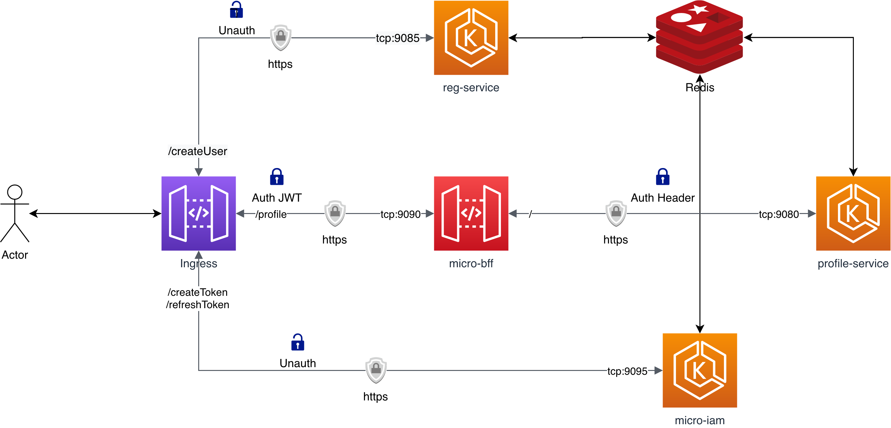
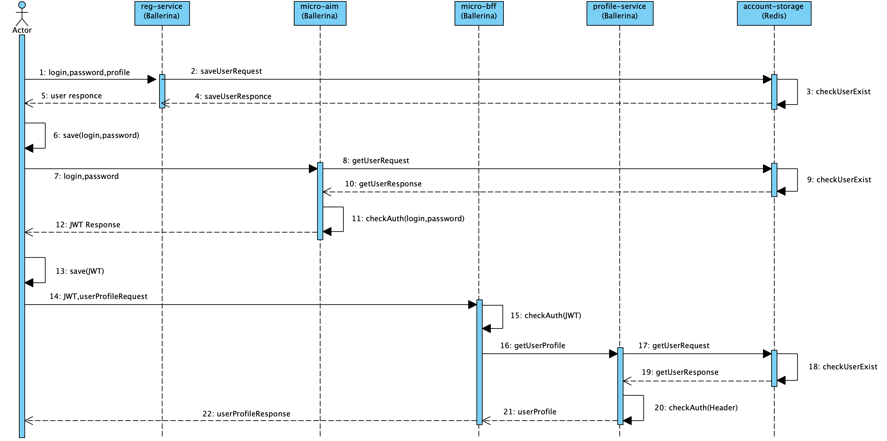

# Homework project for the course OTUS: [Software Architect](https://otus.ru/lessons/arhitektor-po/) 2020

## Тема: Backend for frontends. Apigateway

### Домашнее задание

Backend for frontends. Apigateway

Добавить в приложение аутентификацию и регистрацию пользователей.

Реализовать сценарий "Изменение и просмотр данных в профиле клиента". 
Пользователь регистрируется. Заходит под собой и по определенному урлу получает данные о своем профиле. Может поменять данные в профиле. Данные профиля для чтения и редактирования не должны быть доступны другим клиентам (аутентифицированным или нет). 

На выходе должны быть

0. описание архитектурного решения и схема взамодействия сервисов (в виде картинки)
1. команда установки приложения (из helm-а или из манифестов). Обязательно указать в каком namespace нужно устанавливать. 
2. команда установки api-gateway, если он отличен от nginx-ingress.
3. тесты постмана, которые прогоняют сценарий:
   - регистрация пользователя 1
   - проверка, что изменение и получение профиля пользователя недоступно без логина
   - вход пользователя 1
   - изменение профиля пользователя 1
   - проверка, что профиль поменялся
   - выход* (если есть)
   - регистрация пользователя 2
   - вход пользователя 2
   - проверка, что пользователь2 не имеет доступа на чтение и редактирование профиля пользователя1. 

В тестах обязательно 

- наличие {{baseUrl}} для урла
- использование домена arch.homework в качестве initial значения {{baseUrl}}
- использование сгенерированных случайно данных в сценарии
- отображение данных запроса и данных ответа при запуске из командной строки с помощью newman.

## Примечания к решению:

- Был использован стек [Ballerina.io](https://ballerina.io/) имеющий интеграцию с [Docker](https://ballerina.io/learn/deployment/docker/). Описание конфигурации Docker начинается в `main.bal` файле каждого сервиса в дериктории `./hw5-jwt-arch/*/main.bal` в соответствии с [документацией](https://github.com/ballerina-platform/module-ballerina-docker). В дальнейшем этот модуль будет заменн на [Code2Cloud](https://ballerina.io/learn/deployment/code-to-cloud/) ([видео](https://www.youtube.com/watch?v=36U5RoTdYhc) по переходу на C2C), но пока в нем нет поддежки обычного Docker (правки у авторов технологии уже запрошены мной).

- Это приложение переведено на новую версию Ballerina Swan Lake Alpha2 с иным синтаксисом.

- В текущей реализации JWT-авторизации в Ballerina есть две известные проблемы:

  - Мне пришлось написать свою функцию авторизации JWT, потому что штатная имела bug, требущий наличие дополнительного обязательного поля в теле JWT и в дополнении с багом, описанном ниже, использование штатной функции не имело смысла. По моему обращению заведена задача [972](https://github.com/ballerina-platform/ballerina-standard-library/issues/972).
  - Не выводится подробное сообщение об ошибки в тип позврата функции авторизации HTTP Handler. После моего общения с сообществом Ballerina завели задачу [974](https://github.com/ballerina-platform/ballerina-standard-library/issues/974).

- В текущей версии SLA2 нельзя передавать в RunTime параметры конфигурации из консоли, поэтому используется небезопасный метод передачи private-данных через ConfigMap Kubernetes. Их можно былобы бы монтировать через шифрованные Secrets при помощи Sops или других систем, но это за пределеами занятия. Так же, в `Config.toml` нельзя делить конфигурацию на секции, как это можно было делать ранее в 1.2.x версии. По моей просьбе заведена задача, она является частью задачи [28401](https://github.com/ballerina-platform/ballerina-lang/issues/28401).

- Между реризами Ballerina Swan Lake на стадии Alpha нет совместимости, поэтому @**[Kapil](https://app.slack.com/team/U01E69Z9R88)** по запросу переписал библиотеку [ballerina-redis](https://github.com/ballerina-platform/module-ballerinax-redis). На момент написания кода библиотека [ballerina-mongo](https://github.com/ballerina-platform/module-ballerinax-mongodb) еще не была портирована с Ballerina Preview 8.

- Так же, есть проблема запуска драйвера [ballerina-redis](https://github.com/ballerina-platform/module-ballerinax-redis) при запуске в образе, собранном модулем [ballerina-docker](https://github.com/ballerina-platform/module-ballerina-docker). Я уведомил об этом автора модуля Redis - @**[Kapil](https://app.slack.com/team/U01E69Z9R88)**, заведена задача и проблема решается иным методом сборки: `bal build --offline`

- На данный момент из-за смены модуля работы с конфигурацией, в Ballerina не реализована Basic Auth, о чем есть задача [862](https://github.com/ballerina-platform/ballerina-standard-library/issues/862), поэтому мне не удалось связать BFF и Profile-Service дополнительной авторизацией чтобы защитить Profile-Service от случайной публикации во вне через Ingress. Можно было написать свой Auth Handler, но я решил этого не делать в рамках задания. 

- В приложении не реализован метод logout.

- Т.е. целью занятия была именно JWT авторизации и BFF-паттерн, то для хранилища использован не оптимальный, но простой вариант в виде Redis, который не подходит не для реальной задачи. 

- Одно из условий задания не выполнимо - нельзя показать что другой пользователь не может получить профиль предыдущего пользователя через тестирование API. Система спроектирована так, что запрос на получение пользователя не требует от посылающего запрос дополнительного ID пользователя или профиля. Все запросы к Profile-Service подписываются JWT-авторизацией, которая содержит поле sub с ID пользователя. BFF проверяет валидность JWT и извлекает это поле, передавая его в Profile-Service для запроса конкретного профиля по данному ID. Если подменить sub в JWT, то ключ будет не валиден. Если попытаться обратиться к Profile-Service без JWT, то будет выдата ошибка авторизации. Т.е. идентификация пользователя в Profile-Service проходит автоматически и делает ее BFF.

- В каталоге `./docs` находятся диаграммы формата [Visaul Paradigm](https://www.visual-paradigm.com).

- Postman-коллкция с тестами https://www.getpostman.com/collections/a57a15611e86c9adf190 каталог HW5.

- А GIT-репозитории содержатся Private-данные в виде P12-контейнеров с сертификатами, ключей в открытом виде, это антипример, но допустимый для данного учебного задания.

  

  ## Установка сервиса проиходит при помощи Helm3:

  - `helm install hw5 -n default --dependency-update ./helm/hw5-jwt` #namespace и имя инсталляции могут быть любыми, привязки к ним нет.
  - Необходим Kubernetes Nginx Ingress.

  

  ## Диаграммы:

  

  

