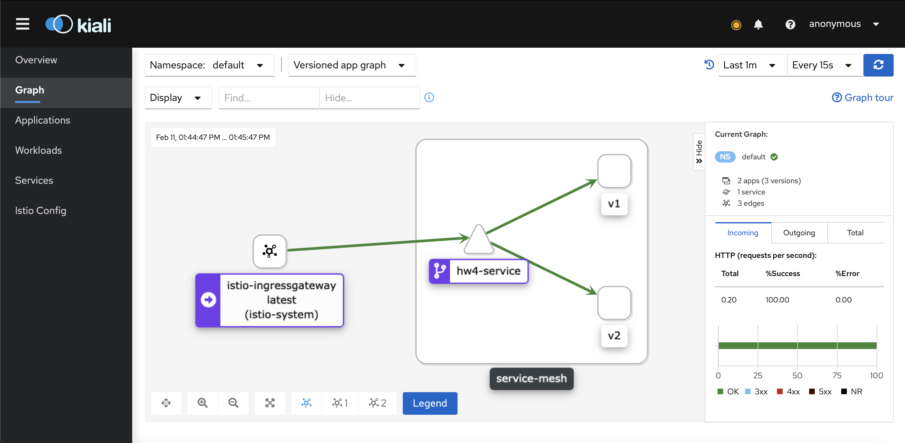
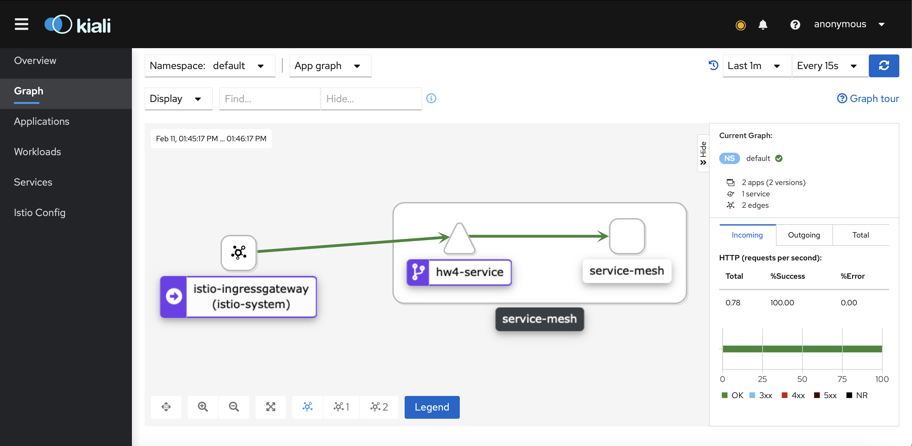
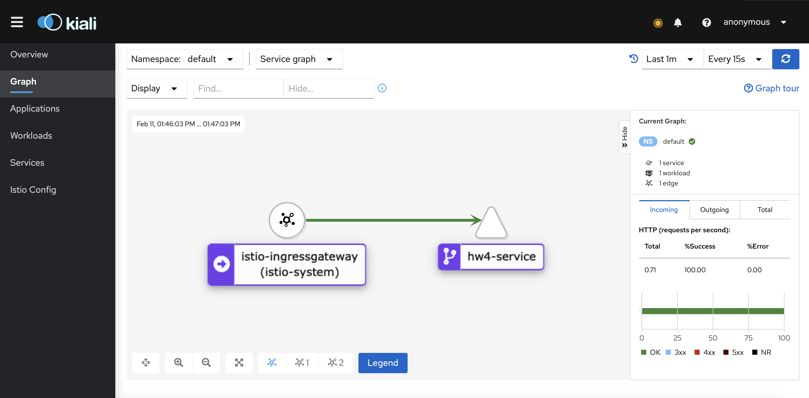
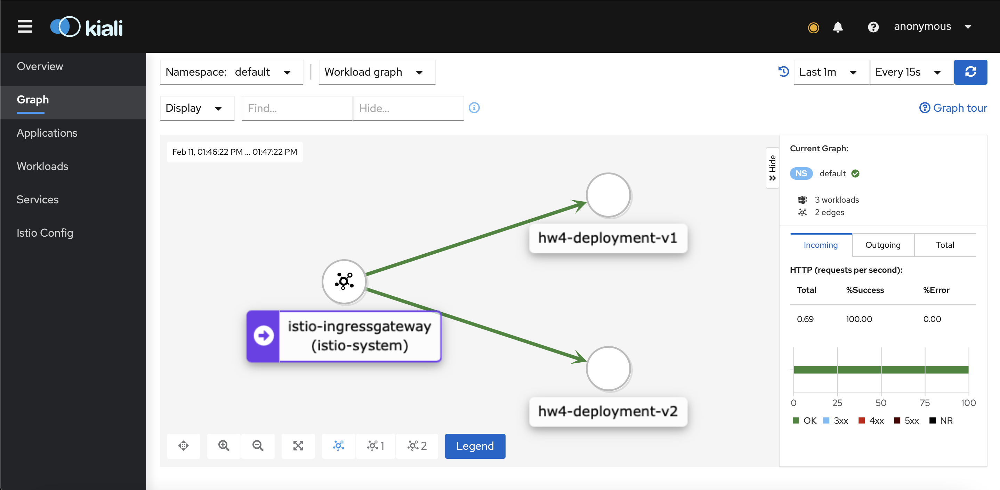
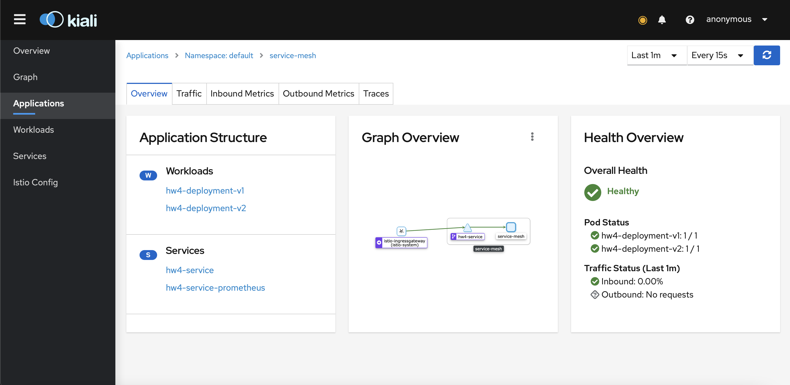
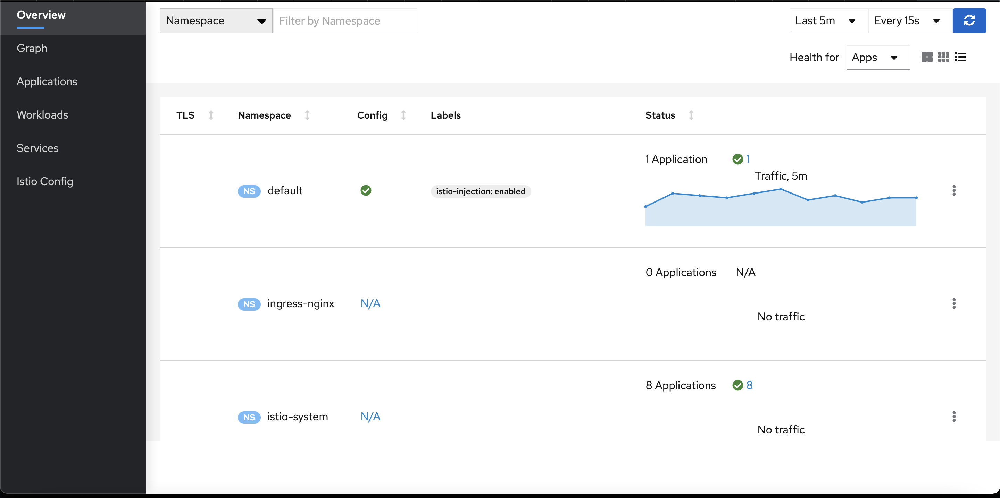
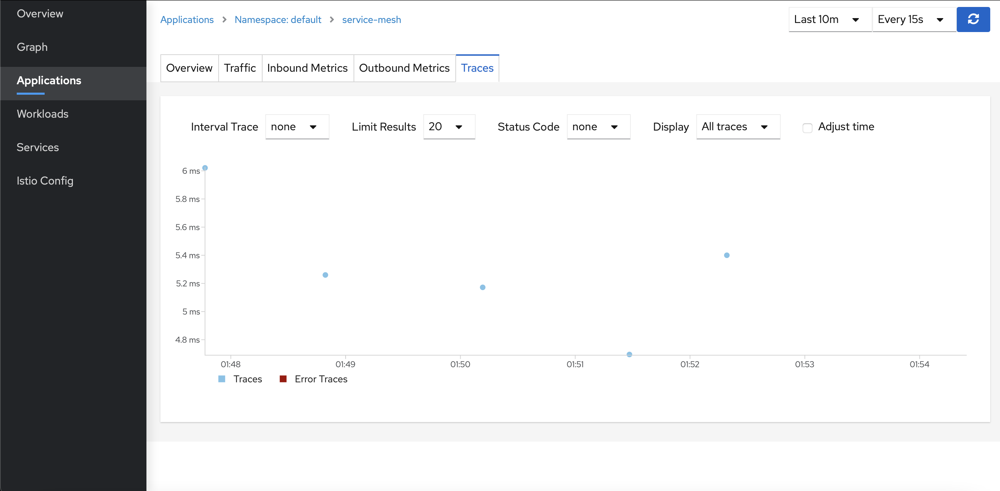
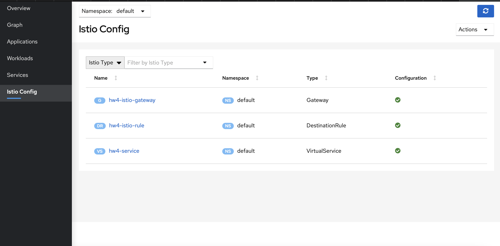

# Homework project for the course OTUS: [Software Architect](https://otus.ru/lessons/arhitektor-po/) 2020


## Тема: Service mesh на примере Istio

### Домашнее задание

Развернуть в кластере две версии приложения и настроить балансировку трафика между ними

Цель: После выполнения ДЗ студент сможет:

- Развернуть Istio в кластере Kubernetes
- Настраивать балансировку трафика между разными версиями приложения

Инструкция к заданию и его описание находится по ссылке https://github.com/izhigalko/otus-homework-istio

Критерии оценки: Работа выполнена в полном объёме - 5 баллов. Если работа выполнена неверно или не в полном объёме, то возвращаем её на доработку.


### Примечания к решению: ###

- Был использован стек [Ballerina.io](https://ballerina.io/) имеющий интеграцию с [Docker](https://ballerina.io/learn/deployment/docker/). Описание конфигурации Docker начинается в коде приложения `./hw4-service-mesh/main.bal` в соответствии с [документацией](https://github.com/ballerina-platform/module-ballerina-docker). В дальнейшем этот модуль будет заменн на [Code2Cloud](https://ballerina.io/learn/deployment/code-to-cloud/) ([видео](https://www.youtube.com/watch?v=36U5RoTdYhc) по переходу на C2C), но пока в нем нет поддежки обычного Docker (правки у авторов технологии уже запрошены мной).
- Это приложение переведено на новую версию Ballerina Swan Lake с иным синтаксисом, docker-образом на основе Java 11 и прочими изменениями из [списка](https://github.com/ballerina-platform/ballerina-lang/releases/tag/vswan-lake-alpha1).
- В демонстрационном приложение подключен Distributed Tracing с испрользованием [Jaeger](https://www.jaegertracing.io) из поставки [Istio](https://istio.io/latest/docs/tasks/observability/distributed-tracing/jaeger/) по официальной документации [Ballerina Observability](https://ballerina.io/learn/observing-ballerina-code/#distributed-tracing).
- Так же, т.к. istio для отрисовки графиков через [Kiali](https://istio.io/latest/docs/tasks/observability/kiali/) с [собой в завимостях](https://istio.io/latest/docs/ops/integrations/prometheus/) запрашивает [Prometheus](https://prometheus.io), то в демонстрационном приложении включены метрики официальной документации [Ballerina Observability](https://ballerina.io/learn/observing-ballerina-code/#monitoring-metrics).
- Для реализации двух разных версий приложения используется один и тот же Docker-образ, но с переключаемыми переменными версии, подключенными через ConfigMap `./hw4-service-mesh/helm/hw4-service-mesh/templates/configmap.yaml` .
- Установка приложения происходит через Helm3, находящийся в директории `./hw4-service-mesh/helm/hw4-service-mesh`.
- При базовой установке Istio в его каталоге `{ISTIO_DIR}/samples/addons` есть некоторые addons, они преднастроены и лучше использовать их, чем отдельные онсталляции того же Kiali, Jaeger, Prometheus для связи с Istio. По ряду статей индивидуальная установка этих компонентов в namespace c istio и только для istio является лучшей практикой чем переиспользование этих компонентов в кластере.
- Конфигурация Istio для эмуляции Canary Deployment находится в файле `./hw4-service-mesh/helm/hw4-service-mesh/templates/istio-canary.yaml`.

**Build для Swan Lake Alpha 1+ & Balerina Tools 0.8.14+:**

- `export DOCKER_USER={LOGIN_DOCKERHUB} && export DOCKER_PASS={PASSWORD_DOCKERHUB} && bal build`

**Deploy с использованием Helm 3:**

- `helm install hw4 ./hw4-service-mesh/helm/hw4-service-mesh`

**Проверка работоспособности:**

```
for i in {1..100}; do sleep 1 && curl http://arch.homework/otusapp/kkeker/whoiam && echo; done 
```

Пример ответа:

```
{"version":"v1"}
{"version":"v2"}
{"version":"v1"}
{"version":"v1"}
{"version":"v2"}
{"version":"v1"}
{"version":"v2"}
{"version":"v2"}
{"version":"v1"}
{"version":"v1"}
{"version":"v2"}
{"version":"v2"}
{"version":"v2"}
{"version":"v1"}
{"version":"v1"}
{"version":"v2"}
{"version":"v1"}
{"version":"v1"}
{"version":"v2"}
{"version":"v2"}
{"version":"v2"}
{"version":"v2"}
{"version":"v2"}
{"version":"v1"}
{"version":"v1"}
{"version":"v2"}
{"version":"v2"}
{"version":"v2"}
{"version":"v2"}
{"version":"v2"}
{"version":"v1"}
{"version":"v2"}
.................
```

Запуск Kiali Dashboard:

`istioctl dashboard kiali`

Снимки работоспособности:


















#### Полезные ссылки:

- Устройство текущей версии Istio https://www.youtube.com/watch?v=16fgzklcF7Y
- Отладка Istio https://www.solo.io
- Интегратор Istio https://banzaicloud.com/, есть материалы и свой Operator в https://operatorhub.io
- Пример Canary Deployment от DigitalOcean https://www.digitalocean.com/community/tutorials/how-to-do-canary-deployments-with-istio-and-kubernetes
- Пример Canary Deployment от Istio https://istio.io/latest/blog/2017/0.1-canary/
- Полноценный Canary Deployment с обновлением приложения от Flagger https://docs.flagger.app/tutorials/istio-progressive-delivery

